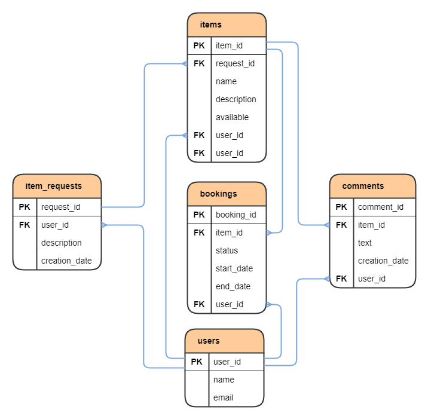

# ShareIt

---
## _Описание проекта._

Backend часть приложения ShareIt.

Приложение является сервисом для "шеринга" (аренды) вещей. Пользователи имеют возможность рассказывать, какими 
вещами они готовы поделиться, а также находить нужную вещь и брать её в аренду на какое-то время. На случай, если 
нужной вещи на сервисе нет, у пользователей есть возможность оставлять запросы на вещь, которую впоследствии может 
добавить другой пользователь в ответ на запрос. Вещь бронируется на определенные даты.  

После возврата вещи владельцу, пользователь может оставить отзыв о ней

Приложение поделено на два микросервиса. Один отвечает за валидацию запросов - _gateway_, т.е. проверку запросов на 
корректность - некорректные запросы будут исключаться. Таким образом, при необходимости его можно масштабировать, 
запустив несколько экземпляров и упростить задачу приема большого количества запросов от пользователей. Второй 
микросервис - _server_, отвечает за логику работы приложения и включает в себя базу данных.

### Технологический стек:

1. Java 11;
2. Spring Boot;
3. Apache Maven;
4. Lombok;
5. PostgreSQL;
6. Docker;
7. Postman;
8. Hibernate.
---

## _Как запустить?_

1. Требуется ПК с Unix подобной ОС: Mac OS, Linux (например Ubuntu). Для остальных ОС требуется поднять виртуальную
   машину (например с помощью VirtualBox, WSL) с одной из Unix подобных ОС.
2. Установить Docker на ПК;
3. Клонировать репозиторий на свой ПК;
4. Сойдать jar файлы из модулей проекта, например через Intellij IDEA с помощью команды mvn package (при повторной
   пересборке рекомендуется использовать чистую сборку: mvn clean package);
5. Запустить приложение через терминал, из папки проекта, командой docker-compose up
---

## _ER-диаграмма БД проекта._

