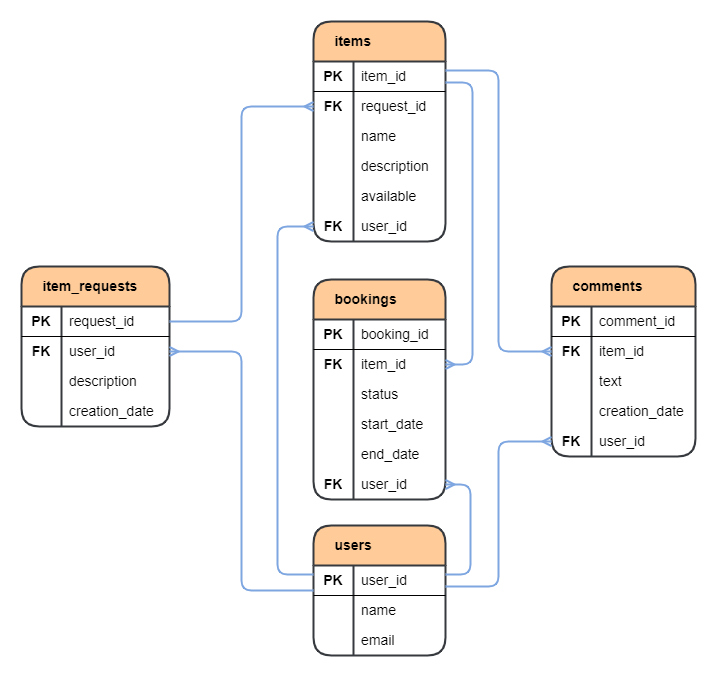

# ShareIt

### Технологический стек:

1. Java 11;
2. Spring Boot;
3. Apache Maven;
4. Lombok;
5. PostgreSQL;
6. Docker;
7. Postman;
8. Hibernate.

## _Описание проекта._

Backend часть приложения ShareIt.

Приложение является сервисом для "шеринга" (аренды) вещей. Пользователи имеют возможность рассказывать, какими 
вещами они готовы поделиться, а также находить нужную вещь и брать её в аренду на какое-то время. На случай, если 
нужной вещи на сервисе нет, у пользователей есть возможность оставлять запросы на вещь, которую впоследствии может 
добавить другой пользователь в ответ на запрос. Вещь бронируется на определенные даты.  

После возврата вещи владельцу, пользователь может оставить отзыв о ней.

Приложение поделено на два микросервиса. Один отвечает за валидацию запросов - _gateway_, т.е. проверку запросов на 
корректность - некорректные запросы будут исключаться. Таким образом, при необходимости его можно масштабировать, 
запустив несколько экземпляров и упростить задачу приема большого количества запросов от пользователей. Второй 
микросервис - _server_, отвечает за логику работы приложения и включает в себя базу данных.

## _Как запустить?_

1. Требуется ПК с Unix подобной ОС: Mac OS, Linux (например Ubuntu). Для остальных ОС требуется поднять виртуальную
   машину (например с помощью VirtualBox, WSL) с одной из Unix подобных ОС.
2. Установить Docker на ПК;
3. Клонировать репозиторий на свой ПК;
4. Сойдать jar файлы из модулей проекта, например через Intellij IDEA с помощью команды mvn package (при повторной
   пересборке рекомендуется использовать чистую сборку: mvn clean package);
5. Запустить приложение через терминал, из папки проекта, командой docker-compose up

## _ER-диаграмма БД проекта._

## _Описание БД проекта._

1. Таблица `users`. Содержит данные о пользователях приложения.
   * _**user_id**_ (первичный ключ) - идентификатор пользователя;
   * _**name**_ - имя пользователя;
   * _**email**_ - электронная почта пользователя.
2. Таблица `item_requests`. Содержить информацию о запросах от пользователей на желаемую вещь.
   * _**request_id**_ (первичный ключ) - идентификатор запроса;
   * _**user_id**_ (внешний ключ) - идентификатор пользователя, автора запроса;
   * _**description**_ - описание запроса;
   * _**creation_date**_ - дата и время создания запроса.
3. Таблица `items`. Содержит данные о вещах.
   * _**item_id**_ (первичный ключ) - идентификатор вещи;
   * _**request_id**_ (внешний ключ) - идентификатор запроса, в ответ на который была добавлена вещь;
   * _**name**_ - название вещи;
   * _**description**_ - описание вещи;
   * _**available**_ - доступна ли вещь для аренды;
   * _**user_id**_ (внешний ключ) - идентификатор пользователя, владельца вещи.
4. Таблица `bookings`. Содержит информацию об аренде вещей.
   * _**booking_id**_ (первичный ключ) - идентификатор аренды;
   * _**item_id**_ (внешний ключ) - идентификатор вещи, которую берут в аренду;
   * _**status**_ - статус аренды;
   * _**start_date**_ - дата и время начала бронирования;
   * _**end_date**_ - дата и время окончания бронирования;
   * _**user_id**_ (внешний ключ) - идентификатор пользователя, автора запроса на аренду вещи.
5. Таблица `comments`. Содержит данные о комментариях от пользователей на вещь, которую они брали в аренду.
   * _**comment_id**_ (первичный ключ) - идентификатор комментария;
   * _**item_id**_ (внешний ключ) - идентификатор вещи, к которой оставили комментарий;
   * _**text**_ - текст комментария;
   * _**creation_date**_ - дата и время создания комментария;
   * _**user_id**_ (внешний ключ) - идентификатор пользователя, автора комментария.